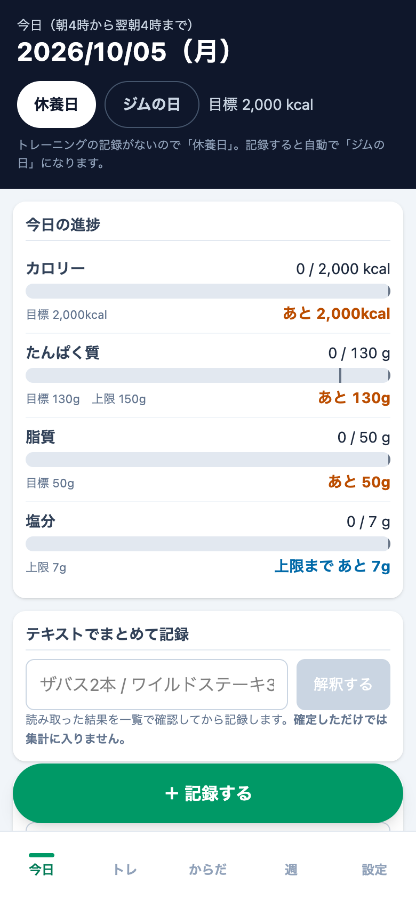

# karada-log

食事を記録して、その日のカロリー・たんぱく質・脂質・塩分を目標と比べながら確認できる、個人用の減量管理 PWA です。データはサーバーに送らず、端末のブラウザ内（IndexedDB）にだけ保存します。

デモ: https://kerokero-1245.github.io/karada-log/



## できること

- その日のカロリー・たんぱく質・脂質・塩分を、目標に対する進捗バーと「あと○」の残量で表示します
- 1 日の区切りを朝 4 時にして、深夜の食事を前日分として集計します
- 「ジムの日」「休養日」を手動で切り替えられ、区分に応じて目標カロリーが変わります
- 「ザバス2本 / ワイルドステーキ300g」のような文章から品目と数量を読み取り、確認してから記録します（外部 API は使いません）
- 読み取れなかった文章は栄養値を付けずに「未処理」として残し、あとから解決できます
- 文章で書いた呼び名と食品の対応を、ユーザーが選んだときに覚えて次回から使います
- 食品を検索して記録でき、検索欄が空のときはよく食べるものを上位に出します
- 「スープ残し / 完飲」のような食べ方の違いを選んで記録できます
- 決まった食事の組み合わせ（固定ベース）から、選んだ品目だけを記録に追加できます
- 栄養成分表示の値をそのまま入力して新しい食品を登録でき、1 単位あたりの値に換算して保存します
- 記録には登録時点の栄養値を写して残すので、あとで食品を直しても過去の記録は変わりません
- 記録した食事の数量・時刻を編集でき、削除もできます
- Claude API キーを設定すると、栄養成分表示や料理の写真から栄養値を読み取れます（キーは端末内にだけ保存します）
- 期間（今週・先週・直近 7 日・直近 14 日・日付指定）を選んで、記録を Markdown でコピー・ダウンロードできます
- 全データを JSON でバックアップし、内容を確認してから復元できます
- 「時刻 品目 数量=kcal/たんぱく質/脂質/炭水化物/塩分」形式の行を貼り付けて、日付ごとにまとめて取り込めます
- 取り込み用の形式で出力してもらうための、claude.ai 向けの依頼文をコピーできます

## 技術

- **UI**: React 19 / TypeScript / Tailwind CSS v4（`@tailwindcss/vite`）
- **ビルド**: Vite 8（`@vitejs/plugin-react`）
- **データ保存**: Dexie 4 で IndexedDB に保存します。画面の更新は Dexie の `liveQuery` を使った自作フックで行います
- **写真の読み取り**: `@anthropic-ai/sdk` でブラウザから Claude API を直接呼び出します
- **PWA**: `vite-plugin-pwa` が Web App Manifest とサービスワーカー（Workbox）を生成し、ビルド成果物をプリキャッシュします。更新は `autoUpdate` で自動的に反映されます
- **Lint**: oxlint
- **デプロイ**: GitHub Actions で `main` への push ごとにビルドし、GitHub Pages に公開します

## 開発

```sh
npm run dev      # 開発サーバーを起動
npm run build    # 型チェックと本番ビルド（dist/ に出力）
npm run preview  # ビルド結果をローカルで確認
npm run lint     # oxlint を実行
```
